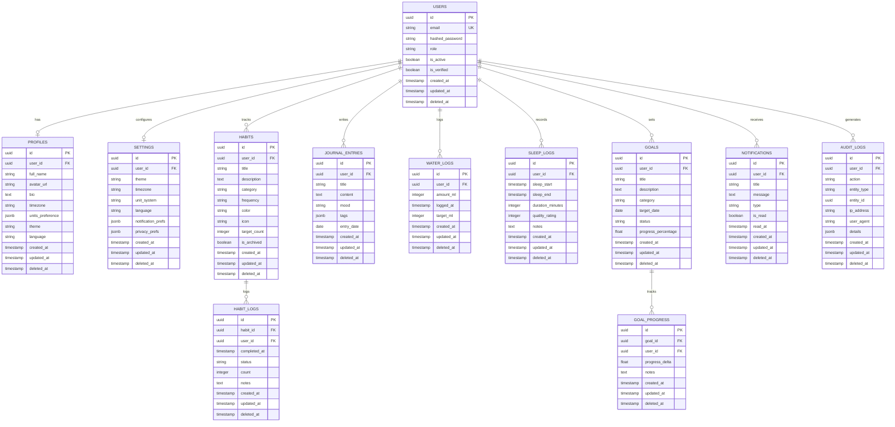

# Database ER Diagram & Data Dictionary - PersonalOS

PersonalOS uses **PostgreSQL 16** with **UUID v4 primary keys**, soft deletes (`deleted_at`), enterprise audit logging, and foreign key indexing across all entities.

---

## 1. Entity Relationship Diagram (ERD)

---

## 2. Global Column Conventions

All 12 tables implement standardized tracking fields:

- `id`: `UUID` (v4 generated via PostgreSQL `gen_random_uuid()` or Python `uuid4()`). Primary Key.
- `created_at`: `TIMESTAMPTZ` default `NOW()`. Indexed.
- `updated_at`: `TIMESTAMPTZ` default `NOW()`, auto-updated on record mutation.
- `deleted_at`: `TIMESTAMPTZ`, NULLABLE. Used for soft delete filtering (`WHERE deleted_at IS NULL`). Indexed.
