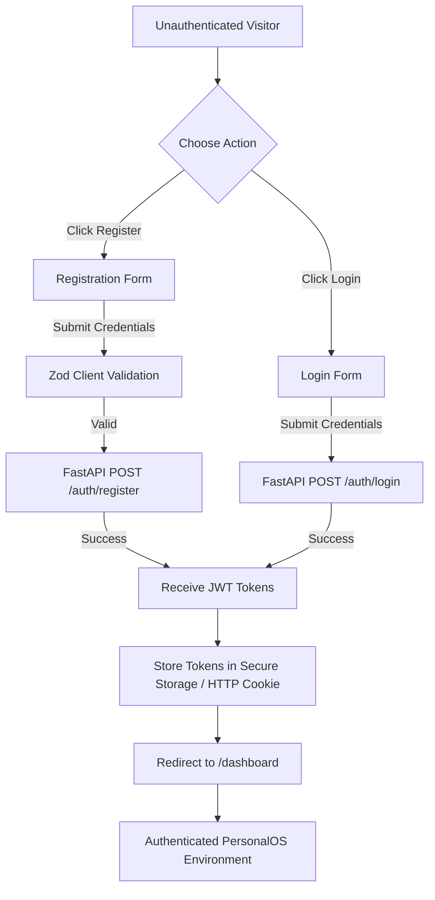
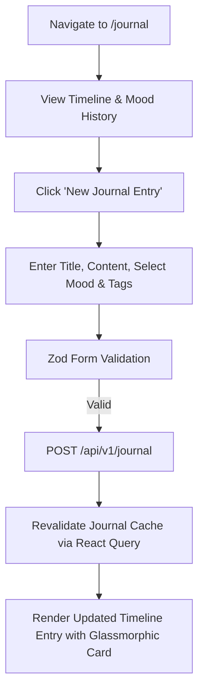
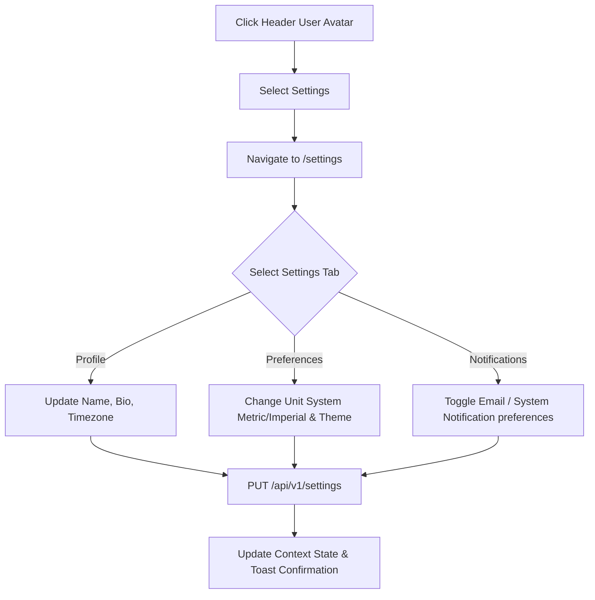

# User Flows & Journeys - PersonalOS

## 1. Authentication & Onboarding Flow



---

## 2. Daily Life Telemetry Flow (Hydration, Sleep, Habits)

```mermaid
graph TD
    A[Dashboard Overview] --> B{Select Quick Action}
    
    B -->|Log Water| C[Quick Water Dialog (+250ml / Custom)]
    C --> D[POST /api/v1/water]
    D --> E[Update Hydration Ring & Dashboard Stats]
    
    B -->|Check Habit| F[Toggle Habit Checkbox]
    F --> G[POST /api/v1/habits/{id}/log]
    G --> H[Update Streak Counter & Consistency Matrix]
    
    B -->|Log Sleep| I[Sleep Quality Modal]
    I --> J[POST /api/v1/sleep]
    J --> K[Update Sleep Telemetry Card]
```

---

## 3. Reflection & Knowledge Capture Flow (Journal)



---

## 4. Goal & Milestone Tracking Flow

```mermaid
graph TD
    A[Navigate to /goals] --> B[View Goal Roadmap & Progress Bars]
    B --> C[Click Goal Card]
    C --> D[Open Goal Detail Modal]
    D --> E[Add Progress Update Delta e.g. +10%]
    E --> F[POST /api/v1/goals/{id}/progress]
    F --> G[Recalculate Goal Progress & Update Status to 'In Progress' or 'Completed']
```

---

## 5. Settings & Profile Preferences Flow


